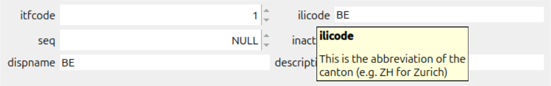
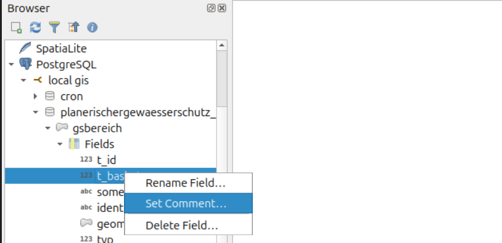
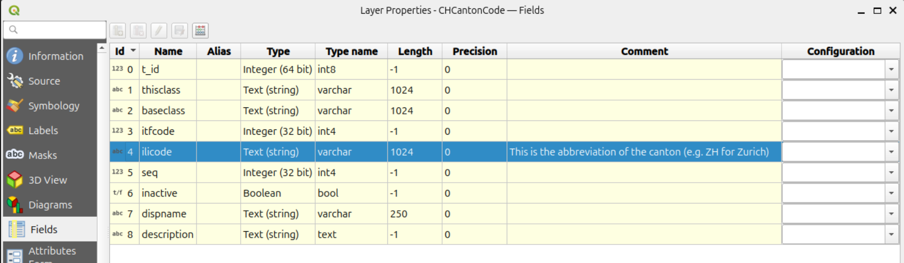
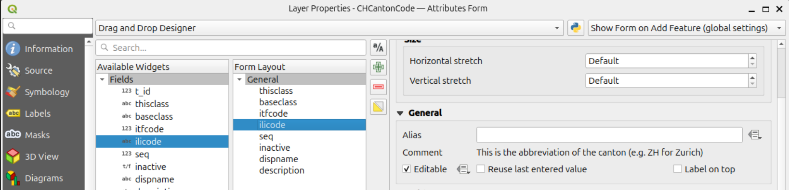

# QGIS Enhancement: Title

**Date** YYYY/MM/DD

**Author** FirstName SurName (@user)

**Contact** user at domain dot tld

**Version** QGIS X.X

# Summary

Field comments should be editable. You can do that via the browser, but often users have no rights to do that or they don't want to change comments on the whole database (for every QGIS project). This leads us to the idea to create client side comments overriding the provider side comments.

## The existing provider side comments

### Where are they defined?

There are column comments are defined in the database. They are mainly used in PostgreSQL...

```
COMMENT ON COLUMN plan.chcantoncode.ilicode IS 'This is the abbreviation of the canton (e.g. ZH for Zurich)';
```

... other providers using it are the `GrassLayers` (I don't know about any others).

They are read on `loadFields` in the provider and stored into the `QgsField` objects.

### Where are they used in QGIS?

The comments are displayed as hover tooltips in the forms.



### Where can these comments be changed?

In the browser you can append such comments to columns. As well you can edit them.



Also in the layer properties "Fields" section you can add a comment on adding a *new* column. But you cannot edit existing ones.



Currently you can see these comments in the layer properties "Attribute Form" section, but you cannot edit them.



## Proposed Solution

The solution does **not propose** to be able to change the provider side comments. It's about **client side comments**, stored in the QGIS configuration (like the aliases).

### Comment definition and storage

This means if we do not set anything, the provider side comments are enabled, when we edit it, the client side comment is 

If no (NULL) client side comment is defined, the provider side comment is loaded. As well if manually defined "data defined override" is activated.

If a client side comment is defined (or an empty string) the provider side comment is not taken into account. Means with empty string you avoid of seeing a comment at all.

The client side comments are stored like the aliases in the project configuration.

```
<maplayer [...]>
    <id>CHCantonCode_9b624185_fd48_48ab_aa93_7f66ed96acca</id>
    [...]
    <aliases>
        [...]
        <alias index="4" field="ilicode" name="Canton Code"/>
    [...]
    <comments>
        <commment index="4" field="ilicode" description="This is the abbreviation of the canton (e.g. ZH for Zurich)">
```

### Visual improvements

Since noone reads a tooltip when no tooltip is defined, this QEP proposes as well an icon in the form. It shows the user, that this field contains additonal information. On clicking the icon, the tooltip appears.

If an empty string is defined as client side comment, the icon is not displayed.

### The server side comments

The existing options to edit / add a provider side comment remain unchanged like they are. In the layer properties "Fields" section the provider side comments are displayed (and they could differ to the client side comments in the "Attribute Form" section).

## Deliverables

- QgsAttributeTypeDialog is enhanced with the edit option for client side comment (and the option to use expressions and "data defined override".
- 

### Example(s)

*(optional)*

### Affected Files

*(optional)*

## Risks

*(required)*

## Performance Implications

**(required if known at design time)**

## Further Considerations/Improvements

*(optional)*

## Backwards Compatibility

**(required if applicable)**

## Issue Tracking ID(s)

*(optional)*
